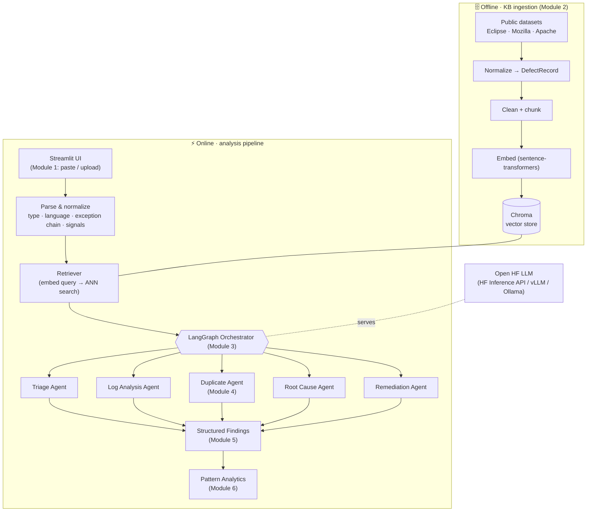
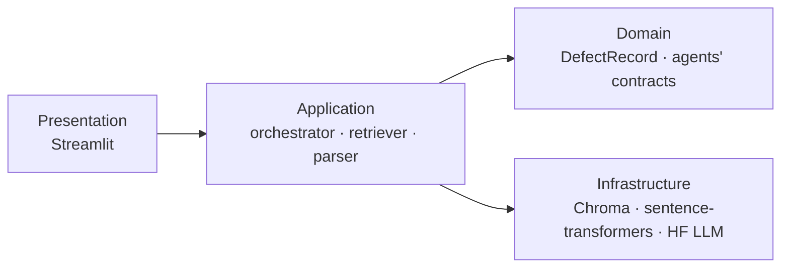
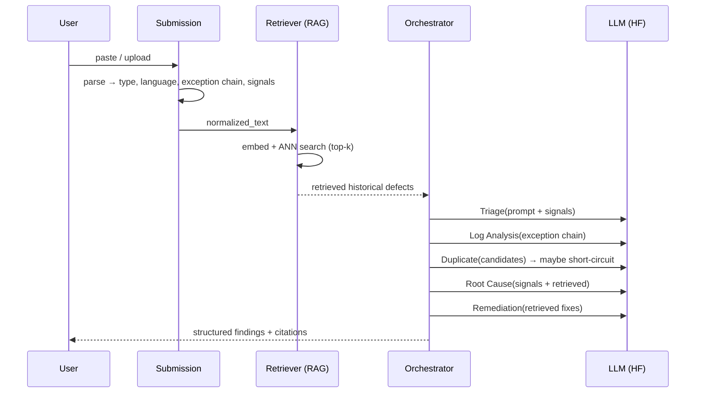

# 02 · System Architecture

## Overview

The system turns a raw bug submission into a structured, grounded analysis by
combining a **RAG knowledge base** of historical defects with a **multi-agent
pipeline**. There are two data-flow paths:

- **Offline (ingestion):** public datasets → normalize → chunk → embed → index.
  Runs when building/refreshing the knowledge base.
- **Online (analysis):** a submission → parse → retrieve similar defects →
  multi-agent reasoning → structured findings → analytics.

> **Milestone 1 scope** implements the shaded pieces end-to-end: the **entire
> offline ingestion path**, the **Bug Submission Module** (parse & normalize),
> and the **Retriever** (the RAG query side), surfaced in the Streamlit UI.
> The orchestrator + 5 agents (Module 3), and Modules 4–6, are scaffolded
> (shared state + retriever + LLM provider are already built) and land in M2+.

---

## Component responsibilities

| # | Module | Responsibility | Status (M1) |
|---|--------|----------------|-------------|
| 1 | **Bug Submission** | Accept paste/upload; detect report vs trace vs log; extract exception chain, log histogram, key signals; normalize | built |
| 2 | **Historical Defect KB + RAG** | Load/normalize datasets; clean, chunk, embed, index; retrieve top-k | built |
| 3 | **Multi-Agent Orchestration** | LangGraph graph coordinating 5 agents over shared state | scaffold (state, roles, LLM provider) |
| 4 | **Duplicate Detection** | Semantic candidate search + threshold, then LLM confirm | retrieval built ·  confirm in M2 |
| 5 | **Structured Findings** | Render triage/root-cause/duplicate/remediation into a report | preview panel |
| 6 | **Pattern Analytics** | Aggregate across defects to find systemic issues | later |

---

## Layered view

- **Presentation** — `app/streamlit_app.py`. Thin; calls the application layer.
- **Application** — `src/submission` (parse), `src/retrieval` (RAG query),
  `src/agents` (orchestration, M2), `src/ingestion/build_kb` (offline).
- **Domain** — `src/schema.py` (`DefectRecord` + enums) and
  `src/agents/state.py` (`AnalysisState`, agent roles). The shared contracts.
- **Infrastructure** — `src/ingestion/{embeddings,vectorstore}.py`,
  `src/llm/provider.py`. Swappable behind interfaces (change the embedding model
  or LLM backend via config, no code change).

---

## Online analysis sequence (target, M2)

The Duplicate agent can **short-circuit**: a confident duplicate skips the
costly root-cause/remediation hops and returns the known defect + its fix.

---

## Deployment / runtime

- **Prototype (now):** everything local — Streamlit + Chroma (persistent on
  disk) + local embeddings. The agent LLM is remote (HF Inference API) or local
  (vLLM/Ollama). Single `pip install`, single `streamlit run`.
- **Scale path:** Chroma → server mode or Qdrant; swap MiniLM → BGE-base for
  recall; move agents onto self-hosted **vLLM** (e.g. Thunder GPU) via the same
  OpenAI-compatible interface. None of these touch agent code — they are config.

See `docs/03_agent_responsibilities.md`, `docs/04_orchestration_flow.md`, and
`docs/05_knowledge_base_data_model.md` for the detailed designs, and
`docs/06_tech_stack.md` for the technology choices.
