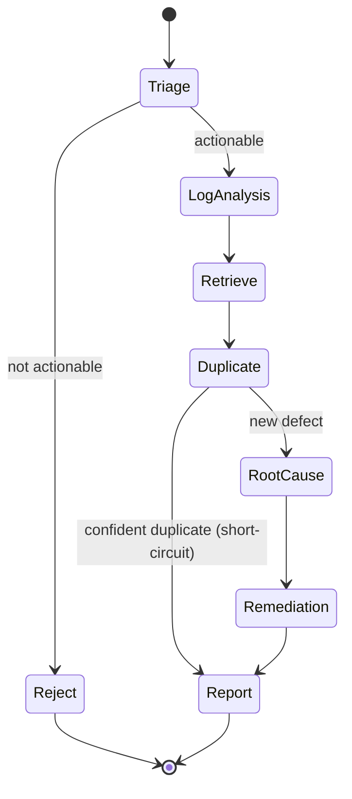

# 04 · Orchestration Flow

Module 3 coordinates the five agents with **LangGraph**, a graph where nodes are
agents and edges are transitions over a shared `AnalysisState`. LangGraph is
chosen over a linear chain because the real workflow has **conditional routing
and early exits** (invalid input, confident duplicate) that a graph expresses
cleanly and that are easy to trace/debug.

## Graph



## Nodes

| Node | Type | Reads | Writes |
|------|------|-------|--------|
| `Triage` | agent | `submission` | `triage` |
| `LogAnalysis` | agent | `submission.exceptions`, `log_level_counts` | `log_findings` |
| `Retrieve` | tool | `submission.normalized_text` | `retrieved` |
| `Duplicate` | agent | `retrieved` | `duplicates`, `is_duplicate` |
| `RootCause` | agent | `submission`, `log_findings`, `retrieved` | `root_cause` |
| `Remediation` | agent | `root_cause`, `retrieved` (fixed only) | `remediation` |
| `Report` | reducer | all above | `final_report` |

`Retrieve` is a plain tool node (no LLM) that populates the shared RAG context
once, so the three retrieval-consuming agents don't each re-query.

## Conditional routing

Two decision points, expressed as LangGraph conditional edges:

```python
def route_after_triage(state: AnalysisState) -> str:
    return "log_analysis" if state["triage"].get("is_actionable") else "reject"

def route_after_duplicate(state: AnalysisState) -> str:
    return "report" if state.get("is_duplicate") else "root_cause"
```

- **Triage gate** — empty / non-actionable input is rejected before any
  expensive LLM reasoning.
- **Duplicate short-circuit** — a confident duplicate returns the canonical
  defect and its known fix, skipping Root Cause + Remediation. This is the
  single biggest cost saver: dedup is cheap, diagnosis is expensive.

## State, persistence, observability

- **State** — a single `AnalysisState` (`src/agents/state.py`) threaded through
  nodes; each writes only its namespaced key, so nodes compose without coupling.
- **Checkpointing** — LangGraph's checkpointer persists state between nodes,
  enabling resume-on-failure and human-in-the-loop pauses (e.g. approve a
  remediation) in later milestones.
- **Tracing** — the graph is inspectable; each node's inputs/outputs can be
  logged (LangSmith-compatible) for debugging the multi-agent run.

## Error handling

- Each agent node is wrapped so an LLM/parse failure appends to `state["errors"]`
  and degrades gracefully (e.g. Root Cause failing still returns triage +
  duplicates) rather than aborting the whole run.
- The Retriever failing (empty KB) yields `retrieved = []`; downstream agents
  then explicitly report "no historical precedent found" instead of guessing.

## Why LangGraph (vs. CrewAI / linear chain)

- Native **conditional branches + cycles** — matches the real triage workflow.
- Explicit **shared state** object — the natural fit for "agents contribute to a
  growing analysis," and trivial to serialize into the Structured Findings
  (Module 5).
- Strong **tracing/checkpointing** — important for debugging multi-agent runs
  and defensible in review. A linear chain can't express the short-circuits;
  CrewAI hides the control flow we specifically want to own.
